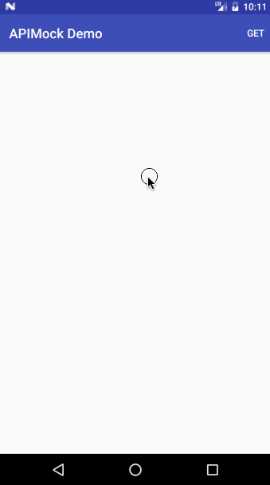
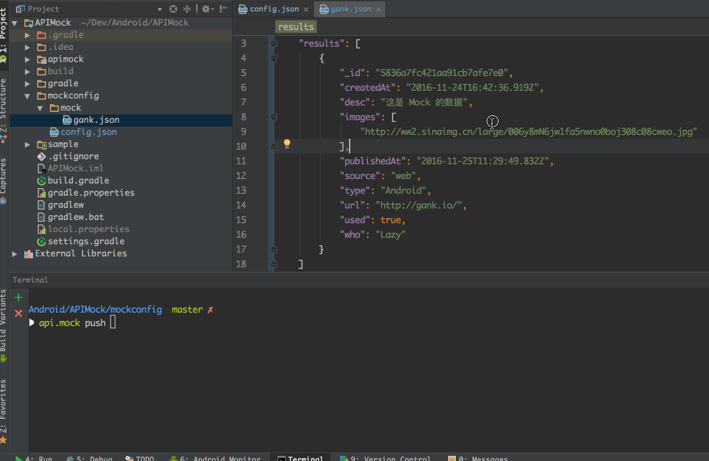
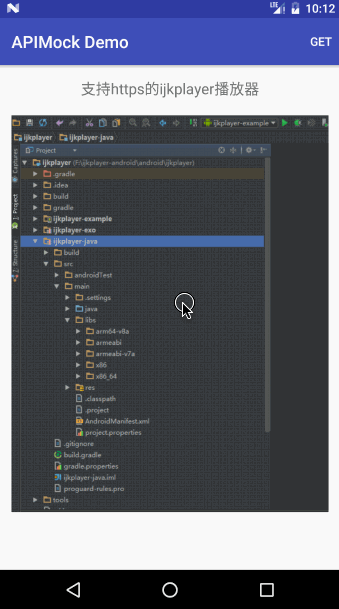

# APIMock

[](https://jitpack.io/#brucezz/APIMock)

Mock API data simply with [OkHttp](https://github.com/square/okhttp).

## Installation

**Step 1.** Add the JitPack repository to your build file

Add it in your root build.gradle at the end of repositories:

```groovy
	allprojects {
		repositories {
			...
			maven { url "https://jitpack.io" }
		}
	}
```

**Step 2.** Add the dependency

```groovy
	dependencies {
        compile 'com.github.brucezz:APIMock:v1.0.1'
	}
```

or 

```groovy
	dependencies {
        compile 'com.github.brucezz:APIMock:v1.0.1'{
           exclude group:'com.squareup.okhttp3'
       }
	}
```


## Usage

**Step 1.** Add `MockInterceptor` to your `OkHttpClient`

```java
    mHttpClient = new OkHttpClient().newBuilder()
        // ...something 
        .addInterceptor(new MockInterceptor())
        .build();
```

**Step 2.** Create your config file `config.json`

Default format:

```JSON
{
    "base": "http://gank.io/api",
    "delay": 1000, 
    "remote": "/storage/emulated/0/APIMock", 
    "route": {
    	"/data/Android/\\d+/\\d+":"mock/gank.json"
    }
}
```


- "remote" : location of config files on Android device
- "base" : api host 
- "delay" : imitate network delay time
- "route" : mock rules
 - key : the path of API URL
 - value : mock data file (JSON)

**Step 3.** Create mock data files

Mock files are JSON files including different response data.

Put your mock files in `mock` directory.

**Step 4.** Push your config files to Android device

A command-line utility is provided -- [APIMockHelper](https://github.com/brucezz/APIMockHelper).

And you can use whatever tools you want :)

Done, enjoy it!

More detail see the sample please.

## Screenshots

First, click the 'GET' to send network request.



Then, create my mock data, push to device.



Finally, make the same request but response changed.



## Credit

Thanks for [Gank.io API](http://gank.io/).
